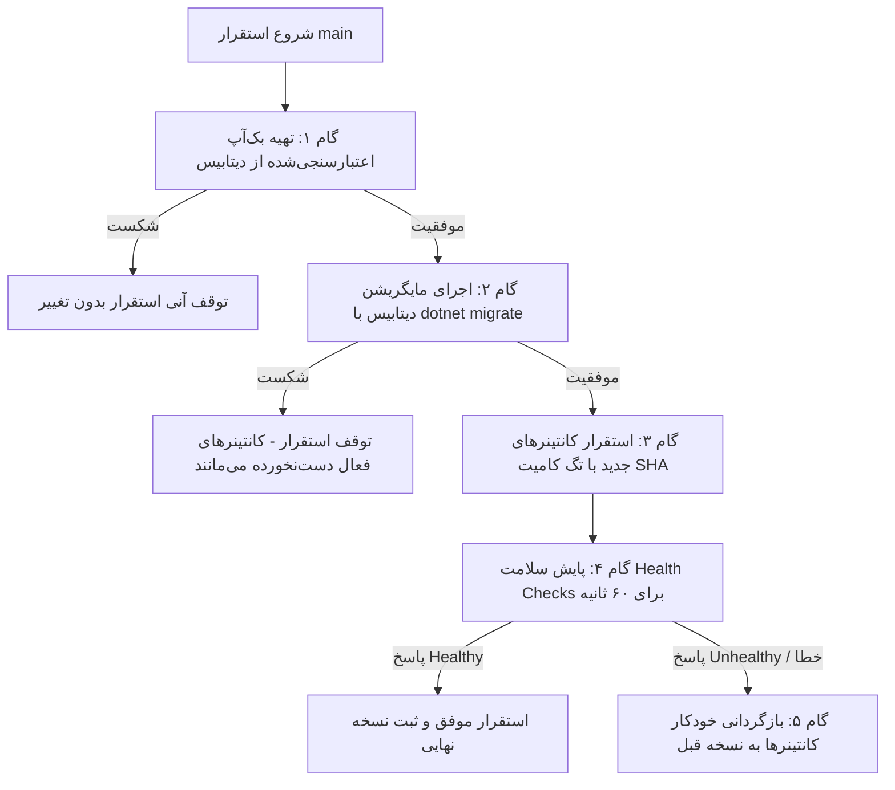

# راهنمای جامع استقرار، تفکیک محیط‌ها و نگهداری ترما (Terma Deployment & Infrastructure Runbook)

این سند مرجع فنی، معماری و عملیاتی راه‌اندازی و نگهداری دو محیط کاملاً ایزوله **استیجینگ (Staging)** و **پروداکشن (Production)** بر روی سرور لینوکس با مشخصات سخت‌افزاری **3 هسته پردازنده (vCPU) و ۶ گیگابایت حافظه رم (RAM)** است.

---

## ۱. معماری سیستم و تخصیص منابع سخت‌افزاری

### ۱.۱. ساختار کلان شبکه و کانتینرها
پروژه از یک موتور پایگاه‌داده اشتراکی SQL Server با دو دیتابیس کاملاً مجزا و دو شبکه ایزوله داکر (`terma-prod-net` و `terma-staging-net`) استفاده می‌کند. درگاه Nginx به عنوان Reverse Proxy بر روی پورت‌های ۸۰ و ۴۴۳ ترافیک دامنه‌ها را مدیریت می‌کند.

```text
                            ┌─────────────────────────────────────────┐
                            │               اینترنت / کاربران         │
                            └────────────────────┬────────────────────┘
                                                 │
                                                 ▼
                            ┌─────────────────────────────────────────┐
                            │     Nginx Gateway (HTTPS: 443 / 80)     │
                            │   0.2 CPU | 128MB RAM (Res: 64MB)       │
                            └──────────┬───────────────────┬──────────┘
                                       │                   │
               https://terma.ir        │                   │  https://staging.terma.ir
                                       ▼                   ▼  (Basic Auth + noindex)
    ┌──────────────────────────────────────┐   ┌──────────────────────────────────────┐
    │       شبکه پروداکشن (terma-prod-net)  │   │       شبکه استیجینگ (terma-staging-net)│
    │                                      │   │                                      │
    │  ┌────────────────────────────────┐  │   │  ┌────────────────────────────────┐  │
    │  │ Frontend: terma-prod-frontend  │  │   │  │ Frontend: terma-staging-front  │  │
    │  │ 0.5 CPU | 384MB (Res: 192MB)   │  │   │  │ 0.15 CPU | 192MB (Res: 64MB)   │  │
    │  └────────────────────────────────┘  │   │  └────────────────────────────────┘  │
    │  ┌────────────────────────────────┐  │   │  ┌────────────────────────────────┐  │
    │  │ Backend: terma-prod-backend    │  │   │  │ Backend: terma-staging-backend │  │
    │  │ 0.75 CPU | 512MB (Res: 256MB)  │  │   │  │ 0.25 CPU | 256MB (Res: 64MB)   │  │
    │  └───────────────┬────────────────┘  │   │  └───────────────┬────────────────┘  │
    └──────────────────┼───────────────────┘   └──────────────────┼───────────────────┘
                       │                                          │
                       │ (terma_prod_user)                        │ (terma_staging_user)
                       ▼                                          ▼
    ┌─────────────────────────────────────────────────────────────────────────────────┐
    │                 موتور پایگاه‌داده: terma-db (SQL Server 2022)                    │
    │                   1.5 CPU | 2048MB RAM (Reservation: 1280MB)                    │
    │                  *هیچ پورتی به بیرون سرور منتشر نمی‌شود (No Host Port)*             │
    │                                                                                 │
    │   ┌──────────────────────────────┐          ┌──────────────────────────────┐    │
    │   │  TermaDb_Production          │          │  TermaDb_Staging             │    │
    │   │  (دسترسی انحصاری پروداکشن)    │          │  (دسترسی انحصاری استیجینگ)   │    │
    │   └──────────────────────────────┘          └──────────────────────────────┘    │
    └─────────────────────────────────────────────────────────────────────────────────┘
```

### ۱.۲. جدول تخصیص و بودجه‌بندی رم و پردازنده (VPS 3 vCPU / 6.0 GB RAM)

| سرویس | سقف پردازنده (CPU Limit) | تضمین پردازنده (CPU Res) | سقف مجاز حافظه (RAM Limit) | حداقل تضمین حافظه (RAM Res) | اولویت OOM |
| :--- | :--- | :--- | :--- | :--- | :--- |
| **SQL Server اشتراکی** | 1.5 vCPU | 1.0 vCPU | **2048 MB** | 1280 MB | بالاترین (Engine) |
| **بک‌اند پروداکشن** | 0.75 vCPU | 0.5 vCPU | **512 MB** | 256 MB | بالا |
| **فرانت‌اند پروداکشن** | 0.5 vCPU | 0.25 vCPU | **384 MB** | 192 MB | بالا |
| **بک‌اند استیجینگ** | 0.25 vCPU | 0.05 vCPU | **256 MB** | 64 MB | پایین (قربانی اولویت OOM) |
| **فرانت‌اند استیجینگ**| 0.15 vCPU | 0.05 vCPU | **192 MB** | 64 MB | پایین (قربانی اولویت OOM) |
| **پروکسی Nginx** | 0.2 vCPU | 0.1 vCPU | **128 MB** | 64 MB | بالا |
| **مجموع سقف کانتینرها** | **~3.35 vCPU (Burst)** | **~1.95 vCPU** | **۳۵۲۰ مگابایت (~۳.۴۴ گیگابایت)** | **۱۹۲۰ مگابایت** | - |
| **فضای آزاد سیستم‌عامل و بافر** | اشتراکی | - | **~۲۶۲۴ مگابایت (~۲.۵۶ گیگابایت آزاد)** | - | **>۴۲٪ حافظه آزاد** |

> [!IMPORTANT]
> با این بودجه‌بندی، حداکثر مصرف همزمان تمام کانتینرها ۳.۵۲ گیگابایت است و بیش از **۲.۵ گیگابایت رم آزاد** جهت عملکرد روان لینوکس، کش دیسک، عملیات بک‌آپ، و پروسه‌های مانیتورینگ باقی می‌ماند. همچنین یک فایل Swap به حجم ۴ گیگابایت فعال می‌شود.

---

## ۲. ایزولاسیون و امنیت پایگاه‌داده

### ۲.۱. تفکیک کامل کاربران و دسترسی‌ها
1. پایگاه‌داده `TermaDb_Production` منحصراً متعلق به کاربر `terma_prod_user` است. کاربر استیجینگ هیچ‌گونه دسترسی یا کاربری در این دیتابیس ندارد.
2. پایگاه‌داده `TermaDb_Staging` منحصراً متعلق به کاربر `terma_staging_user` است.
3. کاربر ارشد `sa` تنها در اسکریپت‌های سیستمی بک‌آپ و آماده‌سازی استفاده می‌شود و رشته اتصال نرم‌افزارها (Connection Strings) هرگز از `sa` استفاده نمی‌کنند.
4. پورت ۱۴۳۳ در فایروال مسدود بوده و در داکر کامپوز به بیرون کانتینر منتشر (`ports`) نمی‌شود.

### ۲.۲. اسکریپت راه‌اندازی دیتابیس
جهت ایجاد و پیکربندی خودکار و امن دیتابیس‌ها و کاربران، اسکریپت زیر تعبیه شده است:
```bash
bash scripts/init-databases.sh
```

---

## ۳. امنیت استیجینگ و سئو

1. **احراز هویت پایه (HTTP Basic Auth)**:
   - تمام ترافیک دامنه استیجینگ (`staging.terma.ir`) توسط Nginx با فایل `/opt/terma/nginx/auth/.htpasswd` محافظت می‌شود.
2. **جلوگیری از ایندکس موتورهای جستجو**:
   - هدر امنیتی `X-Robots-Tag: noindex, nofollow, noarchive, nosnippet` توسط Nginx تزریق می‌شود.
   - متغیر `NEXT_PUBLIC_SITE_INDEXING_ENABLED=false` در فرانت‌اند استیجینگ فعال است که مسیر `/robots.txt` را روی `Disallow: /` تنظیم می‌کند.
3. **عدم ارسال پیامک، پیام تلگرام یا تراکنش واقعی**:
   - در تنظیمات استیجینگ، `SmsIr:Enabled = false` و `Telegram:Enabled = false` است. کدهای OTP برای تست در لاگ ماسک‌شده ذخیره می‌شوند و پیامکی به شماره واقعی ارسال نمی‌شود.

---

## ۴. چرخه گیت و CI/CD در GitHub Actions

### ۴.۱. استراتژی برنچ‌ها (`Branching Strategy`)
```text
feature/* ──(PR)──> develop [استقرار خودکار در Staging] ──(PR)──> main [نیازمند تأیید دستی برای Production]
```

1. **برنچ `develop`**:
   - با هر Push یا ادغام PR، بررسی‌های کیفیت کد (Lint, Typecheck, Tests, Build) اجرا شده و سپس نسخه جدید با شناسه کامیت (Git SHA) در محیط **Staging** مستقر می‌شود.
2. **برنچ `main`**:
   - مستقیماً قفل است (Branch Protection Rules). ادغام صرفاً از طریق Pull Request امکان‌پذیر است.
   - استقرار در محیط **Production** منوط به تأیید رسمی بازبین در محیط گیت‌هاب (`Environment: production`) است.
3. **شناسه کامیت (Git SHA Versioning)**:
   - تصاویر و کانتینرها با شناسه اختصاصی کامیت تگ می‌خورند (مثال: `terma-backend:a1b2c3d`). بدین ترتیب همواره مشخص است کدام نسخه روی سرور در حال اجراست و بازگشت (Rollback) به نسخه قبل با دقت تضمین می‌شود.

---

## ۵. خط لوله استقرار بدون ریسک پروداکشن (Zero-Risk Deployment)

فرآیند استقرار پروداکشن به صورت گام‌به‌گام و خودکار طبق الگوی زیر در `scripts/deploy-prod.sh` اجرا می‌شود:



### تفکیک بازگردانی اپلیکیشن از بازیابی دیتابیس
> [!IMPORTANT]
> در صورت بروز خطا در مرحله Health Check پس از استقرار، صرفاً **کانتینرهای نرم‌افزار به نسخه پایدار قبلی بازگردانده می‌شوند** (`rollback-app.sh`). دیتابیس به صورت خودکار Restore نمی‌شود تا تراکنش‌ها و سفارشات ثبت‌شده مشتریان در آن بازه زمانی از بین نرود. مایگریشن‌ها همواره به صورت Backward-Compatible طراحی می‌شوند.

---

## ۶. سیستم بک‌آپ‌گیری، چرخش و بازیابی (Disaster Recovery)

### ۶.۱. اسکریپت بک‌آپ‌گیری (`scripts/backup-db.sh`)
- بک‌آپ بومی با پسوند `.bak` همراه با `CHECKSUM` و `COMPRESSION`.
- بررسی سلامت فایل با دستور `RESTORE VERIFYONLY`.
- **سیاست نگهداری محلی**:
  - ۳ نسخه آخر قبل از هر استقرار (`pre-deploy`)
  - ۷ نسخه روزانه اخیر (`daily`)
  - ۴ نسخه هفتگی اخیر (`weekly`)
- **همگام‌سازی ابری خارج از سرور (Off-site Cloud Sync)**:
  - قابلیت ارسال خودکار به فضاهای ذخیره‌سازی S3 / آروان‌کلود / Cloudflare R2 از طریق ابزار `rclone` یا AWS CLI.

### ۶.۲. آزمون اعتبارسنجی بازیابی (`scripts/test-restore.sh`)
جهت اطمینان از سلامت استراتژی Disaster Recovery، اسکریپت تست خودکار زیر تعبیه شده است:
```bash
bash scripts/test-restore.sh
```
این اسکریپت یک بک‌آپ تازه تهیه کرده، آن را در یک دیتابیس مجزای تستی به نام `TermaDb_RestoreTest` بازیابی می‌کند، وجود و سلامت جداول اصلی را می‌سنجد و در پایان دیتابیس تستی را حذف می‌نماید.

### ۶.۳. اسکریپت بازیابی دستی با محافظت پروداکشن (`scripts/restore-db.sh`)
```bash
# بازیابی روی محیط استیجینگ
bash scripts/restore-db.sh /opt/terma/backups/daily/prod_backup.bak TermaDb_Staging

# بازیابی روی محیط پروداکشن (نیازمند فلگ تایید صریح)
bash scripts/restore-db.sh /opt/terma/backups/pre-deploy/prod_backup.bak TermaDb_Production --force-prod-restore
```

---

## ۷. آماده‌سازی و مقاوم‌سازی اولیه سرور (Server Hardening)

### ۷.۱. اجرای اسکریپت پیکربندی پایه
روی سرور تازه لینوکس دستور زیر را با دسترسی root اجرا کنید:
```bash
bash scripts/setup-server.sh
```
این اسکریپت اقدامات زیر را انجام می‌دهد:
1. ایجاد کاربر غیر روت `deployer` با عضویت در گروه `docker`.
2. ایجاد ۴ گیگابایت حافظه Swap با `swappiness=15`.
3. فعال‌سازی فایروال UFW (تنها پورت‌های ۲۲، ۸۰ و ۴۴۳ باز، مسدودسازی پورت‌های داخلی ۱۴۳۳، ۸۰۸۰، ۸۰۸۱).
4. محدودسازی حجم لاگ‌های داکر در `/etc/docker/daemon.json` (حداکثر ۱۰ مگابایت، ۳ فایل).
5. ایجاد ساختار پوشه‌ها در `/opt/terma/` و تولید اعتبارنامه Basic Auth برای استیجینگ.

### ۷.۲. گواهی‌های SSL با Certbot
```bash
# دریافت گواهی پروداکشن
certbot certonly --webroot -w /var/www/certbot -d terma.ir -d www.terma.ir

# دریافت گواهی استیجینگ
certbot certonly --webroot -w /var/www/certbot -d staging.terma.ir
```

### ۷.۳. زمان‌بندی Cron
دستور `crontab -e` را برای کاربر `deployer` باز کرده و خطوط زیر را اضافه کنید:
```cron
# مانیتورینگ سلامت سرویس‌ها هر ۱۰ دقیقه
*/10 * * * * bash /opt/terma/scripts/monitor-health.sh >> /opt/terma/logs/cron.log 2>&1

# بک‌آپ‌گیری روزانه در ساعت ۰۲:۰۰ بامداد
0 2 * * * bash /opt/terma/scripts/backup-db.sh prod --daily >> /opt/terma/logs/backup.log 2>&1

# بک‌آپ‌گیری هفتگی یکشنبه‌ها در ساعت ۰۳:۰۰ بامداد
0 3 * * 0 bash /opt/terma/scripts/backup-db.sh prod --weekly >> /opt/terma/logs/backup.log 2>&1
```

---

## ۸. جدول مرجع اسرار و متغیرهای محرمانه (Secrets Reference)

> [!NOTE]
> هیچ مقدار حساسی نباید در ریپازیتوری کامیت شود. جدول زیر نام متغیرهای مورد نیاز در **GitHub Secrets** و سرور را نشان می‌دهد:

| نام متغیر / سکرت | محل تعریف | توضیحات / هدف |
| :--- | :--- | :--- |
| `SSH_HOST` | GitHub Secrets | آدرس IP سرور لینوکس |
| `SSH_DEPLOY_USER` | GitHub Secrets | کاربر استقرار غیر روت (`deployer`) |
| `SSH_PRIVATE_KEY` | GitHub Secrets | کلید خصوصی SSH جهت اتصال به سرور |
| `SSH_PORT` | GitHub Secrets | پورت SSH (پیش‌فرض ۲۲) |
| `PROD_DOMAIN` | GitHub Variables / `.env.production` | دامنه اصلی پروداکشن (`terma.ir`) |
| `STAGING_DOMAIN` | GitHub Variables / `.env.staging` | دامنه استیجینگ (`staging.terma.ir`) |
| `DB_SA_PASSWORD` | `.env.production` & `.env.staging` | رمز عبور حساب اصلی SQL Server جهت بک‌آپ |
| `PROD_DB_PASSWORD` | `.env.production` | رمز عبور کاربر انحصاری `terma_prod_user` |
| `STAGING_DB_PASSWORD` | `.env.staging` | رمز عبور کاربر انحصاری `terma_staging_user` |
| `PROD_OTP_HASH_KEY` | `.env.production` | کلید ۳۲+ کاراکتری هش چالش‌های پیامک پروداکشن |
| `STAGING_OTP_HASH_KEY` | `.env.staging` | کلید ۳۲+ کاراکتری هش چالش‌های استیجینگ |
| `PROD_SMSIR_API_KEY` | `.env.production` | کلید API سامانه SMS.ir در پروداکشن |
| `PROD_SMSIR_TEMPLATE_ID`| `.env.production` | شناسه قالب اعتبارسنجی SMS.ir در پروداکشن |
| `S3_BUCKET_NAME` | `.env.production` | نام باکت پشتیبان‌گیری ابری |
| `AWS_ACCESS_KEY_ID` | `.env.production` | کلید دسترسی باکت ابری (در صورت فعال بودن Offsite) |
| `AWS_SECRET_ACCESS_KEY` | `.env.production` | کلید محرمانه باکت ابری |

---

## ۹. چک‌لیست پایش و ریسک‌های باقیمانده

1. **ریسک پر شدن دیسک سرور**: لاگ‌های داکر با محدودیت ۱۰ مگابایتی و نگهداری حداکثر ۳ نسخه مهار شده‌اند. همچنین سیاست چرخش فایل‌های `.bak` قدیمی فعال است.
2. **ریسک شوک بار ترافیکی روی استیجینگ**: استیجینگ به صورت سفت‌وسخت به ۰.۲۵ پردازنده و ۲۵۶ مگابایت رم محدود شده و در صورت کمبود حافظه کلی، سیستم‌عامل ابتدا کانتینرهای استیجینگ را متوقف خواهد کرد تا پروداکشن پایدار بماند.
3. **ریسک تداخل مایگریشن‌ها**: در پروداکشن `AutoMigrate` غیرفعال است و اعمال تغییرات ساختاری صرفاً در مرحله قبل از روشن شدن کانتینرهای جدید انجام می‌شود.
